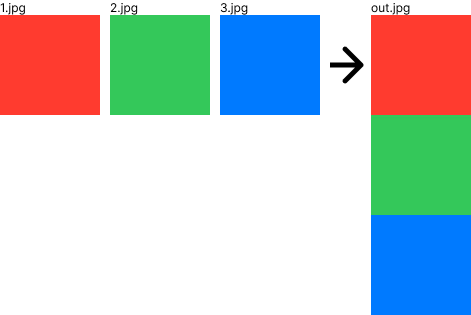
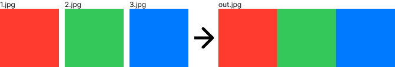
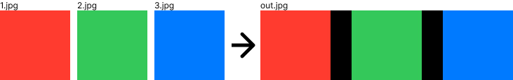
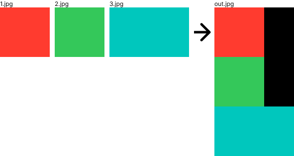
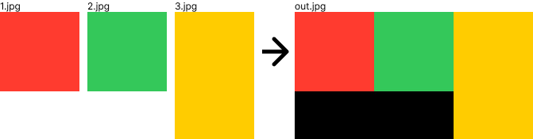

# node-merge-images
Merges images.  
You can optionally set the merging orientation (vertical or horizontal), margins between images, etc.

Click [here](CHANGELOG.md) to see the change log.

- [node-merge-images](#node-merge-images)
    - [Supported OS](#supported-os)
    - [Requirements](#requirements)
    - [Installation](#installation)
    - [Image Merging API](#image-merging-api)
        - [Usage](#usage)
        - [Parameters](#parameters)
        - [Return value](#return-value)
        - [Throws](#throws)
    - [Unit testing](#unit-testing)
    - [Author](#author)
    - [License](#license)

## Supported OS
- Linux
- MAC

## Requirements
Requires imagemagick CLI tools to be installed.
- For instance, if you're on OS X you can use Homebrew.
    ```sh
    brew install imagemagick
    ```
- For Linux, use yum.  
    ```sh
    sudo yum -y install ImageMagick
    ```

## Installation
```sh
npm install --save node-merge-images
```

## Image Merging API
### Usage
- Merge vertically.  
    ```js
    const mergeImages = require('node-merge-images');

    await mergeImages(['1.jpg', '2.jpg', '3.jpg'], 'out.jpg');
    ```
    
- Merge horizontally.
    ```js
    const mergeImages = require('node-merge-images');

    await mergeImages(['1.jpg', '2.jpg', '3.jpg'], 'out.jpg', {direction: 'horizontal'});
    ```
    
- Merge vertically with 30px spacing.  
    In the example, the background color is set to #000 with the background option.
    ```js
    const mergeImages = require('node-merge-images');

    await mergeImages(['1.jpg', '2.jpg', '3.jpg'], 'out.jpg', {offset: 30, background: '#000'});
    ```
    
- Merge horizontally with 30px spacing.  
    In the example, the background color is set to #000 with the background option.
    ```js
    const mergeImages = require('node-merge-images');

    await mergeImages(['1.jpg', '2.jpg', '3.jpg'], 'out.jpg', {direction: 'horizontal', offset: 30, background: '#000'});
    ```
    
- Merge images of different sizes vertically.  
    The image width after merging will be adjusted to the image with the maximum width.
    ```js
    const mergeImages = require('node-merge-images');

    await mergeImages(['1.jpg', '2.jpg', '3.jpg'], 'out.jpg');
    ```
    
- Merge images of different sizes horizontally.  
    The image height after merging will be adjusted to the image with the maximum height.
    ```js
    const mergeImages = require('node-merge-images');

    await mergeImages(['1.jpg', '2.jpg', '5.jpg'], 'out.jpg', {direction: 'horizontal', offset: 30});
    ```
    

### Parameters
- {string[]} inputPaths Path list of images to merge.
- {string} outputPath Output destination path for merged images.
- {'vertical'|'horizontal'} options.direction?  Direction of the merged image. Default is vertical.
- {string} options.background?  
    The background color of the merged image.  
    This option accepts a color name, a hex color, or a numerical RGB, RGBA, HSL, HSLA, CMYK, or CMYKA specification.  
    For example, blue, #dddddff, rgb(255,255,255), etc.  
    Default is white.  
- {number} options.offset? Offset in pixels between each image. Default is 0.

### Return value
{Promise&lt;void&gt;

### Throws
- {TypeError} Input path is not Array.
- {TypeError} Input path is empty.
- {TypeError} Output path is empty.
- {TypeError} The direction option is not "vertical" or "horizontal".
- {TypeError} Offset option is not greater than or equal to 0.
- {TypeError} Input path file not found.
- {Error} Error executing convert command.

## Unit testing
```sh
npm run test
# > node-merge-images@1.0.0 test
# > jest

#  PASS  tests/merge-images.test.js
#   Merge images
#     ? Should be merged vertically. (17 ms)
#     ? If the direction option is "vertical", the merge should be vertical. (12 ms)
#     ? Should merge horizontally. (12 ms)
#     ? Should merge vertically with 30px spacing. (12 ms)
#     ? Should merge horizontally with 30px spacing. (12 ms)
#     ? When vertically merging images of different sizes, the width should be adjusted to the image with the largest width. (13 ms)
#     ? When horizontally merging images of different sizes, the height should be adjusted to the image with the largest height. (14 ms)

#  PASS  tests/case-of-exception.test.js
#   Case of exception
#     ? Should throw an error if the input path is not an Array. (152 ms)
#     ? Should throw an error if the input path is an empty array. (1 ms)
#     ? Should throw an error if the output path is empty.
#     ? Should throw an error if the direction option is not "vertical" or "horizontal". (4 ms)
#     ? Should throw an error if the offset option is not a number greater than or equal to 0. (1 ms)

# Test Suites: 2 passed, 2 total
# Tests:       12 passed, 12 total
# Snapshots:   0 total
# Time:        1.989 s, estimated 2 s
# Ran all test suites.
```

## Author
**Takuya Motoshima**

* [github/takuya-motoshima](https://github.com/takuya-motoshima)
* [twitter/TakuyaMotoshima](https://twitter.com/TakuyaMotoshima)
* [facebook/takuya.motoshima.7](https://www.facebook.com/takuya.motoshima.7)

## License
[MIT](LICENSE)